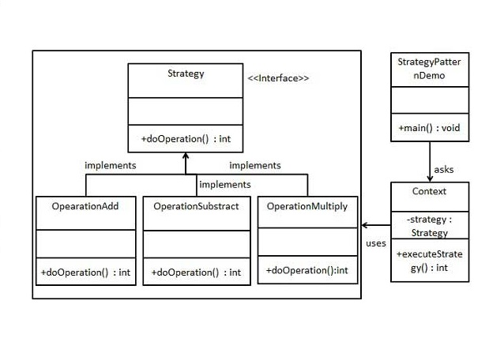

# Strategy Pattern
<p>
In Strategy pattern, a class behavior or its algorithm can be changed at run time. This type of design pattern comes under behavior pattern.

In Strategy pattern, we create objects which represent various strategies and a context object whose behavior varies as per its strategy object. The strategy object changes the executing algorithm of the context object.
</p>

## IOC - Inversion Of Control. SOC - Seperation  Of Concern
<p>
ioc is moving part of the code into another class for better usability and loose coupling. Strategy Pattern can be used in this case
</p>	


## Implementation

<p>
 </img>
</p>


```
public interface Strategy {
   public int doOperation(int num1, int num2);
}
public class OperationAdd implements Strategy{
   @Override
   public int doOperation(int num1, int num2) {
      return num1 + num2;
   }
}
public class OperationSubstract implements Strategy{
   @Override
   public int doOperation(int num1, int num2) {
      return num1 - num2;
   }
}
public class OperationMultiply implements Strategy{
   @Override
   public int doOperation(int num1, int num2) {
      return num1 * num2;
   }
}

public class Context {
   private Strategy strategy;

   public Context(Strategy strategy){
      this.strategy = strategy;
   }

   public int executeStrategy(int num1, int num2){
      return strategy.doOperation(num1, num2);
   }
}

public class StrategyPatternDemo {
   public static void main(String[] args) {
      Context context = new Context(new OperationAdd());		
      System.out.println("10 + 5 = " + context.executeStrategy(10, 5));

      context = new Context(new OperationSubstract());		
      System.out.println("10 - 5 = " + context.executeStrategy(10, 5));

      context = new Context(new OperationMultiply());		
      System.out.println("10 * 5 = " + context.executeStrategy(10, 5));
   }
}


output.

10 + 5 = 15
10 - 5 = 5
10 * 5 = 50

```